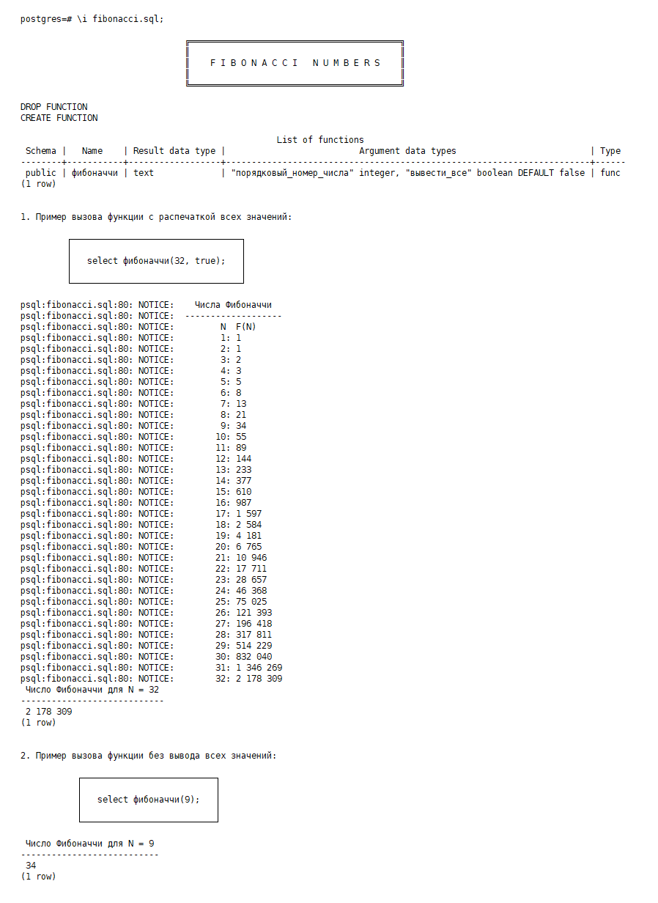

# PLPGSQL-Fibonacci_Numbers

Creating Fibonacci function with the help of PL/pgSQL language for calling it by indicating one of two alternative argument sets implementations: with or without boolean parameter value - to list optionally all previous Fibonacci numbers:

:copyright:yaro4luck
